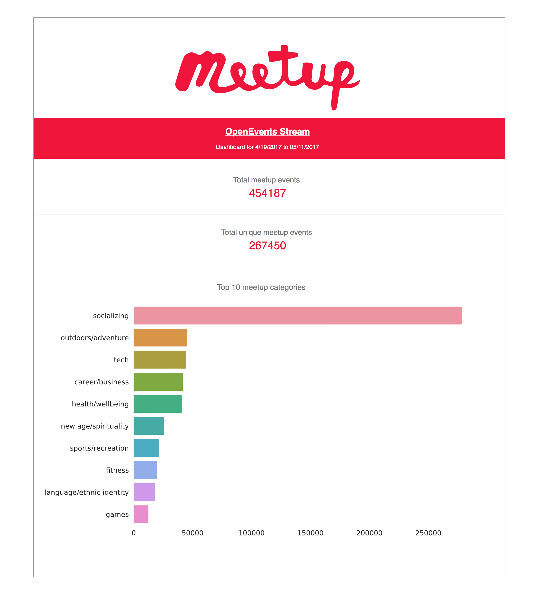

# Meetup OpenEvents Stream Data

Stream and analyze event data from Meetup.com using the OpenEvents Stream API and AWS products.

[Official Meetup API](https://www.meetup.com/meetup_api/docs/stream/2/open_events/)

[Live OpenEvents Stream](http://stream.meetup.com/2/open_events)

## Architecture
Overview of the data system and tools used.

### Stream
- Python script utilizing the requests library

- Kinesis + boto pipes the data to S3

- EC2 executes the above script

### Storage
- All unstructured data (JSON) stored on S3

- JSON files are stored in a year/month/day/hour directory structure

### Structure
- Spark (PySpark) reads raw JSON and transforms it to structured Parquet format, adhering to third normal form (3NF)

- EMR handles the above data transformations - a cluster is programmatically spun up every hour via a script running on an EC2 instance to ETL new data

- The structured data is then also stored on S3

### Synthesize
- Spark SQL is used to query temporary table like structures created from the Parquet files

- Simple analysis on event data - for example, counts of top meetup categories, cities, and countries

- Machine Learning performed using Spark ML implementing a Random Forest Classifier to predict group category ("outdoor/adventure" vs "tech") using the description text as the feature matrix

### Show
- Spark dataframes are plotted by way of Pandas and Seaborn

- Boto interfaces with AWS and connects the HTML and plots generated to a S3 bucket that will host the static page to serve as a dashboard ([View Dashboard](https://s3.amazonaws.com/meetupevents-dashboard/meetupevents-report.html) or see below screenshot)

## Adherence to Principles of Big Data Systems
### Robustness and fault tolerance

- AWS is a fairly robust platform however it's possible for their products and services to malfunction or go down

- The code here is certainly not perfect but through trial and error more fault tolerances have been added (for example iterating on try/except block in stream script)

### Low latency reads and updates
- Queries with Spark SQL and Parquet (which is optimized for columnar scaled data) are slow compared to a database so it may be worth exploring using a database as the data grows

- Spark Streaming is something else worth exploring to get high-throughput, fault-tolerant stream processing of live data streams

### Scalability
- As mentioned above, in the face of increasingly data, a database may serve better as well as refactoring code (for example the script to generate html and plots)
- In terms of resources, most AWS products allow for easy scalability (for example S3 is massively scalable)

### Generalization
- This data system is fairly generalizable, certainly in terms of products and services used for distributing and computing the data

- An area of improvement is again to refactor code so that is flexible to more data or potentially different data (again the script to generate html and plots could benefit here)

### Extensibility
- Similar to the principle of Generalization having code that is more modular rather than inflexible to one type of task or architecture is an area to improve upon in the future

### Ad hoc queries
- Ad hoc queries on this system work fairly well, however as mentioned above there are some latency issues regarding using Spark SQL and Parquet

### Minimal maintenance
- As this system is quite simple, compared to other big data systems, the maintenance seems as though it would be reasonable
- "Automating" aspects of the sytem (such as using Vagrant and programmatically spinning up clusters) helps keep the number of manual tasks to a minimum

### Debuggability
- This is an area for big improvement, while there are some error messages built into the scripts here it's quite minimal
- Along the same lines, but not necessarily for pure debugging, more monitoring/logging functionality could be added to alert when processes fail or scripts error out
